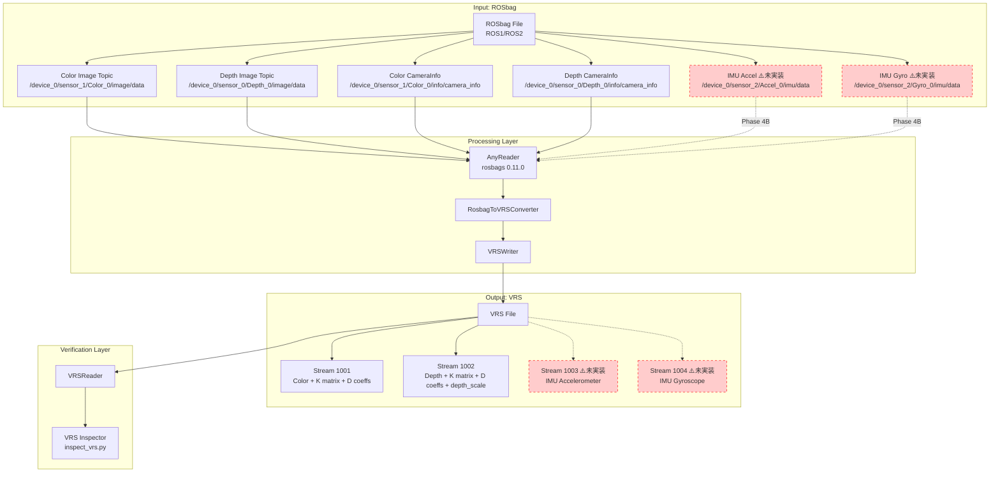
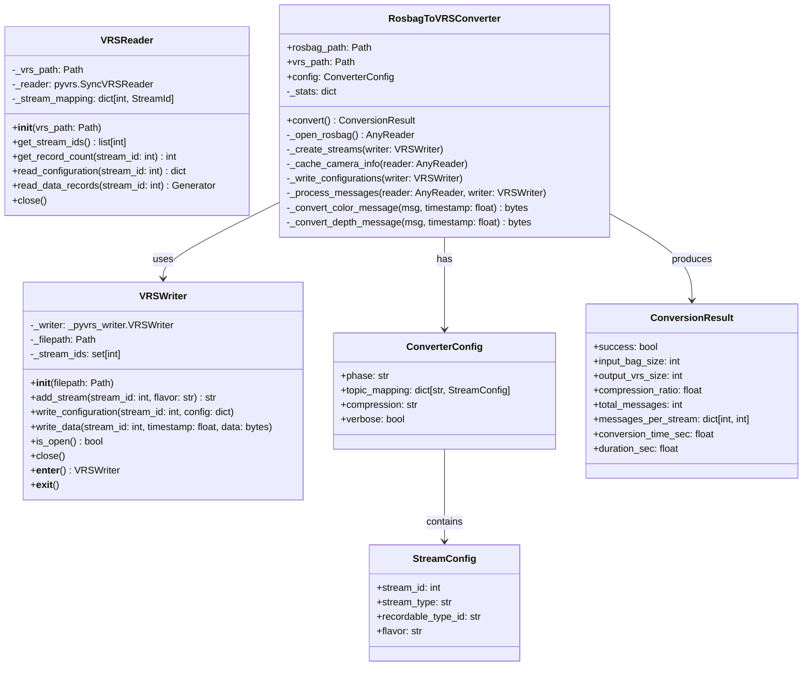
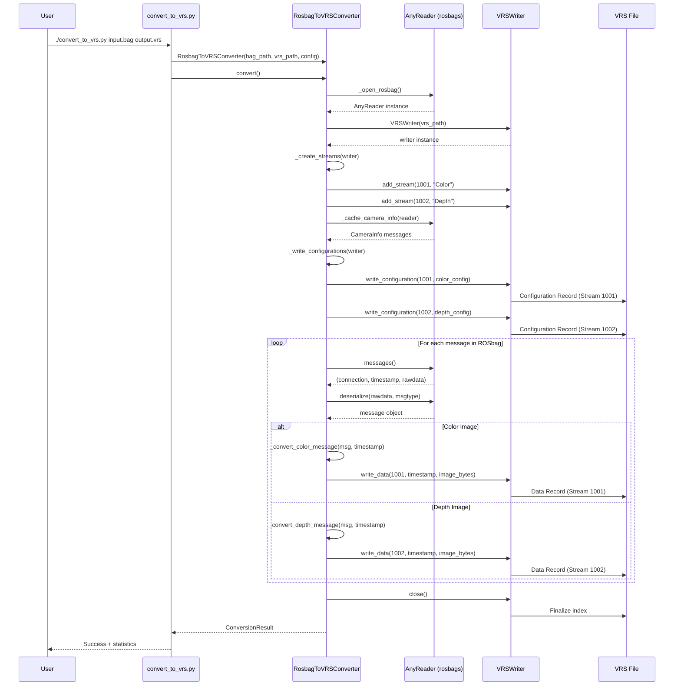
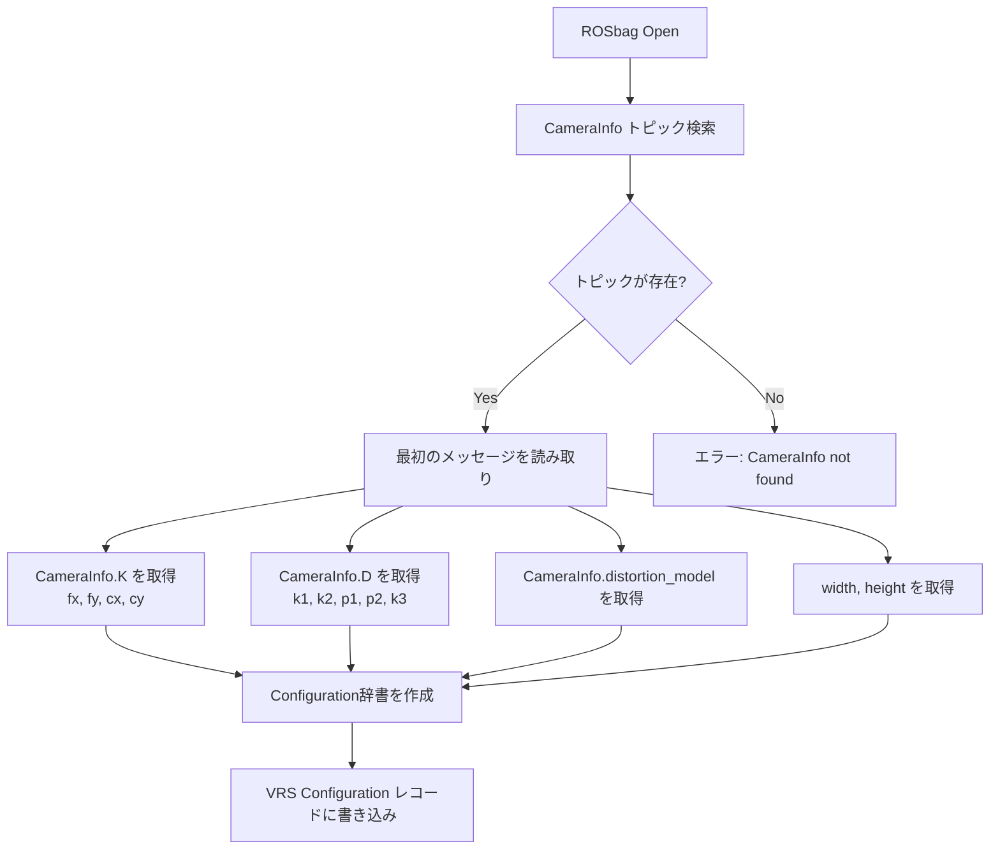

# 実装詳細: RealSense ROSbag → VRS 変換システム

**RealSense D435i ROSbagと同等のカメラパラメータ取得 + RGB-D-IR + IMU記録・再生システムの実装詳細**

---

## 📋 目次

1. [システムアーキテクチャ](#システムアーキテクチャ)
2. [クラス構造とAPI](#クラス構造とapi)
3. [データフロー](#データフロー)
4. [カメラパラメータ取得と保存](#カメラパラメータ取得と保存)
5. [実装済み機能 (Phase 4A)](#実装済み機能-phase-4a)
6. [未実装機能と実装ロードマップ](#未実装機能と実装ロードマップ)
7. [VRS APIの使用方法](#vrs-apiの使用方法)

---

## システムアーキテクチャ

### 全体構成



---

## クラス構造とAPI

### クラス図



### 主要クラスの役割

| クラス名 | 役割 | ファイル |
|---------|------|---------|
| `VRSWriter` | VRSファイルへの書き込み（pyvrs_writerラッパー） | `scripts/vrs_writer.py:38` |
| `VRSReader` | VRSファイルからの読み込み（PyVRSラッパー） | `scripts/vrs_reader.py:20` |
| `RosbagToVRSConverter` | ROSbag → VRS 変換ロジック | `scripts/rosbag_to_vrs_converter.py:84` |
| `ConverterConfig` | 変換設定（ストリームマッピング、圧縮等） | `scripts/rosbag_to_vrs_converter.py:24` |
| `StreamConfig` | VRSストリーム設定（ID、タイプ、flavor） | `scripts/rosbag_to_vrs_converter.py:24` |

---

## データフロー

### 変換処理のシーケンス



---

## カメラパラメータ取得と保存

### ROSbag からのカメラパラメータ抽出

#### 1. CameraInfo メッセージの構造

ROSbag内の `sensor_msgs/CameraInfo` メッセージには以下の情報が含まれます：

```python
# sensor_msgs/CameraInfo
header:
  stamp: {sec, nanosec}
  frame_id: str

width: int          # 画像幅
height: int         # 画像高さ
distortion_model: str  # 歪みモデル ("plumb_bob", "Brown Conrady" など)

# カメラ内部パラメータ行列 (3x3, row-major order)
K: [fx,  0, cx,
     0, fy, cy,
     0,  0,  1]

# 歪み係数 (5要素)
D: [k1, k2, p1, p2, k3]

# Rectification matrix (3x3)
R: [...]

# Projection matrix (3x4)
P: [...]

binning_x: int
binning_y: int
roi: RegionOfInterest
```

#### 2. パラメータの取得プロセス



#### 3. 実装コード（抜粋）

```python
# scripts/rosbag_to_vrs_converter.py:172
def _cache_camera_info(self, reader: Any) -> None:
    """CameraInfo メッセージをキャッシュ"""
    camera_info_topics = [
        "/device_0/sensor_1/Color_0/info/camera_info",  # Color
        "/device_0/sensor_0/Depth_0/info/camera_info"   # Depth
    ]

    with reader:
        connections = [x for x in reader.connections
                      if x.topic in camera_info_topics]

        for connection, timestamp, rawdata in reader.messages(connections=connections):
            # rosbags 0.11.0 API
            msg = reader.deserialize(rawdata, connection.msgtype)
            self._stats["camera_info_cache"][connection.topic] = msg
```

```python
# scripts/rosbag_to_vrs_converter.py:211
def _write_color_configuration(self, writer: VRSWriter, ...) -> None:
    """Color ストリームの Configuration レコードを書き込み"""
    camera_info = self._stats["camera_info_cache"].get(camera_info_topic)

    config_data = {
        "width": int(camera_info.width),
        "height": int(camera_info.height),
        "encoding": "rgb8",
        "camera_k": list(camera_info.K),  # [fx, 0, cx, 0, fy, cy, 0, 0, 1]
        "camera_d": list(camera_info.D),  # [k1, k2, p1, p2, k3]
        "distortion_model": camera_info.distortion_model,
        "frame_id": camera_info.header.frame_id
    }

    writer.write_configuration(stream_id, config_data)
```

### VRS への保存形式

#### Configuration レコードの構造

```json
{
  "stream_id": 1001,
  "record_type": "Configuration",
  "data": {
    "width": 640,
    "height": 480,
    "encoding": "rgb8",
    "camera_k": [616.52, 0.0, 315.87, 0.0, 616.65, 244.28, 0.0, 0.0, 1.0],
    "camera_d": [0.0, 0.0, 0.0, 0.0, 0.0],
    "distortion_model": "Brown Conrady",
    "frame_id": ""
  }
}
```

---

## 実装済み機能 (Phase 4A)

### ✅ Color Stream (Stream ID: 1001)

**対応ROSbagトピック:**
- `/device_0/sensor_1/Color_0/image/data` (sensor_msgs/Image)
- `/device_0/sensor_1/Color_0/info/camera_info` (sensor_msgs/CameraInfo)

**保存データ:**
- RGB画像データ (bytes)
- カメラ内部パラメータ (K matrix: 3x3)
- 歪み係数 (D vector: 5 elements)
- 歪みモデル (distortion_model: str)
- 解像度 (width, height)

**実装ファイル:**
- `scripts/rosbag_to_vrs_converter.py:211` - `_write_color_configuration()`
- `scripts/rosbag_to_vrs_converter.py:260` - `_process_color_message()`

### ✅ Depth Stream (Stream ID: 1002)

**対応ROSbagトピック:**
- `/device_0/sensor_0/Depth_0/image/data` (sensor_msgs/Image)
- `/device_0/sensor_0/Depth_0/info/camera_info` (sensor_msgs/CameraInfo)

**保存データ:**
- Depth画像データ (bytes, 16UC1)
- カメラ内部パラメータ (K matrix: 3x3)
- 歪み係数 (D vector: 5 elements)
- 歪みモデル (distortion_model: str)
- 解像度 (width, height)
- **Depth scale** (0.001 = 1mm単位 → メートル変換)

**実装ファイル:**
- `scripts/rosbag_to_vrs_converter.py:234` - `_write_depth_configuration()`
- `scripts/rosbag_to_vrs_converter.py:273` - `_process_depth_message()`

---

## 未実装機能と実装ロードマップ

### 🚧 Phase 4B: IMU Streams (未実装)

#### 必要な実装

**1. Stream 定義の追加**

```python
# scripts/rosbag_to_vrs_converter.py に追加
STREAM_ID_IMU_ACCEL = 1003
STREAM_ID_IMU_GYRO = 1004

def create_phase_4b_config(...) -> ConverterConfig:
    return ConverterConfig(
        phase="4B",
        topic_mapping={
            "/device_0/sensor_2/Accel_0/imu/data": StreamConfig(
                stream_id=1003,
                stream_type="imu_accel",
                recordable_type_id="MotionSensor",
                flavor="RealSense_D435i_Accel"
            ),
            "/device_0/sensor_2/Gyro_0/imu/data": StreamConfig(
                stream_id=1004,
                stream_type="imu_gyro",
                recordable_type_id="MotionSensor",
                flavor="RealSense_D435i_Gyro"
            ),
        },
        # ... Color/Depth も含める
    )
```

**2. IMU Configuration レコード作成**

```python
def _write_imu_accel_configuration(self, writer: VRSWriter, ...) -> None:
    """IMU Accelerometer Configuration レコードを書き込み"""
    config_data = {
        "sensor_type": "accelerometer",
        "unit": "m/s^2",
        "range": 4.0,  # ±4G
        "sample_rate": 250.0,  # 250 Hz
        "frame_id": "imu_link"
    }
    writer.write_configuration(stream_id, config_data)
```

**3. IMU Data レコード処理**

```python
def _process_imu_accel_message(self, msg, timestamp: float) -> bytes:
    """IMU加速度データを変換"""
    # sensor_msgs/Imu -> bytes
    accel_data = struct.pack(
        'ddd',  # double x3
        msg.linear_acceleration.x,
        msg.linear_acceleration.y,
        msg.linear_acceleration.z
    )
    return accel_data
```

**必要な修正箇所:**
1. `scripts/rosbag_to_vrs_converter.py:84` - `RosbagToVRSConverter`クラス
   - `_write_imu_accel_configuration()` メソッド追加
   - `_write_imu_gyro_configuration()` メソッド追加
   - `_process_imu_accel_message()` メソッド追加
   - `_process_imu_gyro_message()` メソッド追加
2. `scripts/rosbag_to_vrs_converter.py:258` - `_process_messages()`
   - IMU トピックの分岐処理を追加

### 🚧 IR (Infrared) Stream (未実装)

#### 必要な構造

**対応ROSbagトピック:**
- `/device_0/sensor_0/Infrared_1/image/data` (sensor_msgs/Image)
- `/device_0/sensor_0/Infrared_2/image/data` (sensor_msgs/Image)

**Stream 定義:**

```python
STREAM_ID_IR1 = 1005
STREAM_ID_IR2 = 1006

StreamConfig(
    stream_id=1005,
    stream_type="ir",
    recordable_type_id="EyeCamera",  # or ForwardCamera
    flavor="RealSense_D435i_IR1"
)
```

**Configuration レコード:**

```json
{
  "width": 1280,
  "height": 720,
  "encoding": "mono8",
  "camera_k": [...],
  "camera_d": [...],
  "distortion_model": "Brown Conrady",
  "frame_id": "infra1_optical_frame"
}
```

### 実装優先順位

| 機能 | Phase | 優先度 | 理由 |
|-----|-------|-------|------|
| Color + Depth | 4A | ✅ 完了 | 最も基本的なRGB-D機能 |
| IMU (Accel/Gyro) | 4B | 🔴 高 | SLAM/VIO に必須 |
| IR (Infrared) | 4C | 🟡 中 | ステレオマッチングに有用 |
| TF (Transforms) | 4D | 🟢 低 | 座標変換情報 |
| Metadata | 4E | 🟢 低 | 追加メタデータ |

---

## VRS APIの使用方法

### pyvrs_writer (書き込み)

```python
from pyvrs_writer import VRSWriter

# VRSファイルを開く
with VRSWriter("output.vrs") as writer:
    # ストリームを追加
    writer.add_stream(1001, "RealSense_Color")

    # Configuration レコードを書き込み
    config = {
        "width": 640,
        "height": 480,
        "camera_k": [fx, 0, cx, 0, fy, cy, 0, 0, 1]
    }
    writer.write_configuration(1001, config)

    # Data レコードを書き込み
    timestamp = 1234567890.123
    image_bytes = b'...'  # RGB画像データ
    writer.write_data(1001, timestamp, image_bytes)
```

### PyVRS (読み込み)

```python
import pyvrs

# VRSファイルを開く
reader = pyvrs.SyncVRSReader("output.vrs")
reader.open()

# ストリーム一覧を取得
streams = reader.get_streams()

# Configuration レコードを読み取り
config_records = [r for r in reader.records() if r.record_type == pyvrs.RecordType.CONFIGURATION]

# Data レコードを読み取り
for record in reader.records():
    if record.record_type == pyvrs.RecordType.DATA:
        # メタデータブロックを取得
        metadata = record.metadata_blocks[0] if record.metadata_blocks else {}

        # カスタムブロック（画像データなど）を取得
        data = record.custom_blocks[0] if record.custom_blocks else b''
```

---

## 技術的な制約と注意事項

### 1. rosbags API の変更

- **rosbags 0.9.x以前**: `Reader.deserialize()` メソッドが存在
- **rosbags 0.11.0**: `AnyReader.deserialize()` に変更
- **対応**: `scripts/rosbag_to_vrs_converter.py` で `AnyReader` を使用

### 2. CameraInfo 属性名の大文字化

- **ROSメッセージ定義**: `K`, `D`, `R`, `P` (大文字)
- **rosbags デシリアライズ後**: `camera_info.K`, `camera_info.D` (大文字のまま)
- **注意**: 小文字 `k`, `d` ではアクセスできない

### 3. VRS RecordFormat の制限

- **現状**: pyvrs_writer では RecordFormat 未対応
- **影響**: Data レコードに構造化されたメタデータを埋め込めない
- **対処**: Configuration レコードにメタデータを集約

---

## まとめ

### 現在の実装状況

| 機能 | ステータス | 実装場所 |
|-----|----------|---------|
| Color Image + K/D | ✅ 完了 | `rosbag_to_vrs_converter.py:211` |
| Depth Image + K/D + depth_scale | ✅ 完了 | `rosbag_to_vrs_converter.py:234` |
| ROSbag同等の情報再生 | ✅ 達成 | Configuration レコードに保存 |
| IMU (Accel/Gyro) | ⏳ Phase 4B | 未実装（ロードマップあり） |
| IR (Infrared) | ⏳ Phase 4C | 未実装（ロードマップあり） |

### pyvrs経由でのRGB-D-IR + IMU読み込み

**現状:**
- ✅ RGB: 読み込み可能（PyVRS経由）
- ✅ Depth: 読み込み可能（PyVRS経由）
- ❌ IR: 未実装（VRSファイルに保存されていない）
- ❌ IMU: 未実装（VRSファイルに保存されていない）

**実装のために必要な構造:**
1. IMU/IRストリームの追加（`create_phase_4b_config`, `create_phase_4c_config`）
2. Configuration レコード作成関数（`_write_imu_*_configuration`, `_write_ir_configuration`）
3. Data レコード処理関数（`_process_imu_*_message`, `_process_ir_message`）
4. `_process_messages()` での分岐処理追加

詳細は本ドキュメントの「未実装機能と実装ロードマップ」セクションを参照してください。

---

**作成日:** 2025-11-19
**作成者:** Claude (Sonnet 4.5)
**バージョン:** 1.0.0
